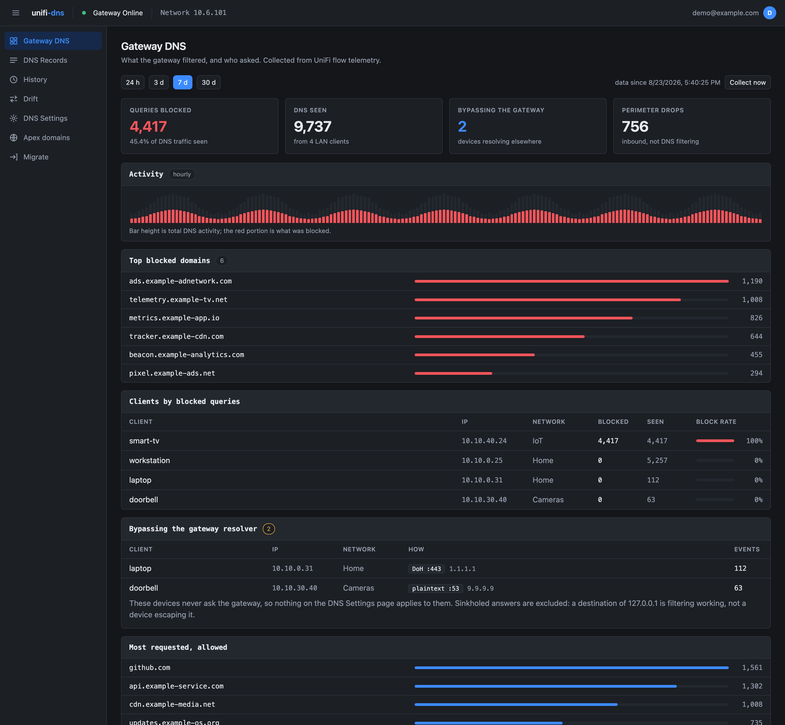
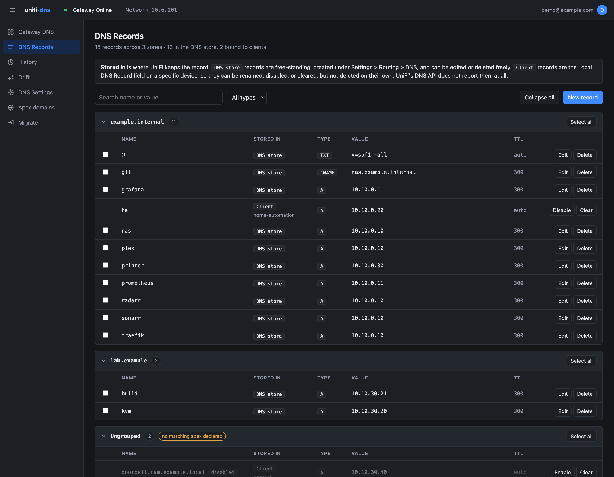
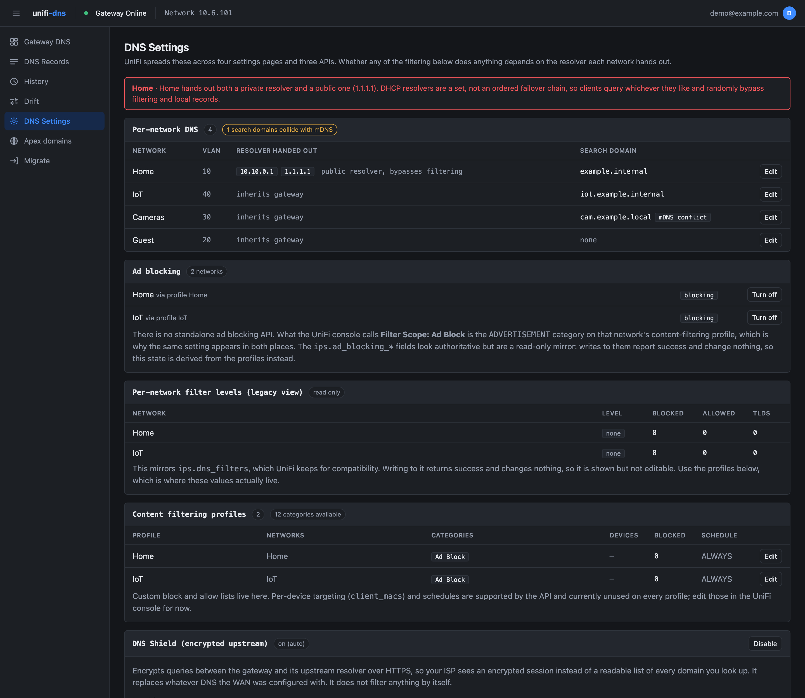
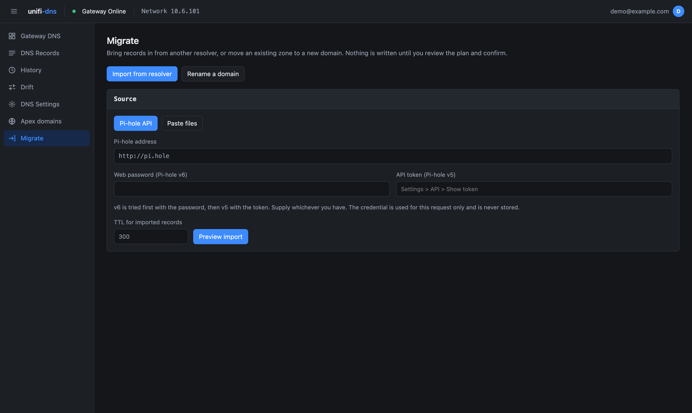

<div align="center">


# unifi-dns

**Zone-aware DNS management and filtering insight for UniFi gateways.**

[](https://ui.com)
[](docs/API.md)
[](backend/)
[](frontend/)
[](docker-compose.yml)
[](LICENSE)

</div>

---

UniFi stores DNS records as a flat, unordered list. The console renders that list
faithfully, which is why there is no way to view records by domain, no sort, no
filter, no bulk edit, and no history. This app imposes the structure the API
never had, and surfaces the filtering data the console keeps but never shows you.

Verified against a UDM Pro running UniFi Network 10.6.101.

> Not affiliated with, endorsed by, or sponsored by Ubiquiti Inc. "UniFi" and
> "Ubiquiti" are trademarks of Ubiquiti Inc., used here only to describe what
> this tool interoperates with.

## Screenshots

<div align="center">

**Gateway DNS** — what the gateway filtered, and who asked



**DNS Records** — grouped into zones UniFi does not have, with both record sources in one view



**DNS Settings** — resolver, search domain, ad blocking and DNS Shield on one page



**Migrate** — import from Pi-hole, Technitium or a zone file, or move a zone to a new domain



<sub>Screenshots are of the bundled demo data (`demo/mock_unifi.py`), not a real network.</sub>

</div>

## What it does

- **Both record sources in one view.** UniFi keeps local DNS records in two
  unrelated places: the DNS store, and a `local_dns_record` field on individual
  client devices. The second is invisible to the DNS API but the gateway
  resolves it anyway. This app reads and manages both, labelled by source.
- **Zones, synthesised.** Declare your apex domains; records group under them by
  longest-suffix match on label boundaries. Anything unmatched shows in a visible
  `Ungrouped` bucket rather than being quietly dropped.
- **Search, filter, sort** across every record.
- **Full record support:** A, AAAA, CNAME, MX, TXT, SRV, including the parts the
  API is fussy about (see Gotchas).
- **Migration in.** Pull records from Pi-hole or Technitium over their APIs, or
  paste a zone file. The zone-file path speaks RFC 1035, so it also covers BIND,
  PowerDNS and a source server that is already switched off.
- **Changesets.** Every mutation is recorded with before/after JSON and an
  author. Nothing bypasses the audit log.
- **Rollback with a plan.** Review the inverse operations before they touch the
  gateway. Applied forward as a new changeset; history is never rewritten.
- **Drift detection.** Anyone editing in the native UniFi console shows up as
  drift, which you can then adopt or revert.
- **DNS settings in one place.** Resolver assignment per network, ad blocking,
  content filtering profiles with custom block/allow lists, DNS Shield, and
  query logging. UniFi spreads these over four settings pages and three APIs.
- **Warnings that matter.** The page flags networks handing out a public
  resolver alongside a private one, which silently defeats every filtering
  control below it.

Not built: a DNS query log. See `TELEMETRY.md`, and Roadmap below.

## Quick start

```bash
cp .env.example .env
```

Two values need setting in `.env`:

**`UNIFI_API_KEY`** — in the UniFi console, go to
**Settings and Logs > Integrations > Create New API Key**. Copy it
immediately; it is shown once, and it is a UniFi OS setting rather than a
Network one. The key is root-equivalent on the gateway
([why](docs/SECURITY.md)).

See [docs/SETUP.md](docs/SETUP.md) to verify the key before starting the app,
and for what to do when the path above has moved.

**`SESSION_SECRET`** — signs session cookies. Generate one:

```bash
openssl rand -hex 32
```

Also set **`UNIFI_HOST`** if your gateway is not on `https://192.168.1.1`.

```bash
docker compose up -d
open http://localhost:8080
```

First run: go to **Apex domains** and add the domains you use. The page suggests
candidates inferred from records already on the gateway, so you can usually
accept those rather than typing them.

By default the app runs with **no authentication** and says so in the header.
Configure OIDC or a forward-auth header before exposing it beyond a trusted
host; see [Security](#security).

## Security

**The UniFi API key is root-equivalent on the gateway.** The UniFi settings
endpoint returns the device SSH password in plaintext to any key holder. Treat
this key like a root password: it is never logged, never returned to the
browser, and never included in an error response. Do not commit `.env`.

That is also why authentication is separate from the key. OIDC (or a trusted
forward-auth header) establishes who the human is; the API key is only what the
app uses to act on the gateway. Configure one of them before exposing this
beyond a trusted host, or the app runs open and warns you at startup.

```bash
# Authentik, Keycloak, Pocket ID, or any OIDC provider
OIDC_ISSUER=https://authentik.example.com/application/o/unifi-dns/
OIDC_CLIENT_ID=...
OIDC_CLIENT_SECRET=...
OIDC_REDIRECT_URL=https://dns.example.com/api/auth/callback

# or, if already behind a forward-auth proxy
TRUSTED_USER_HEADER=X-Forwarded-User
```

## Architecture

```
React + TypeScript  ->  FastAPI  ->  UniFi Integration v1 API
                            |
                        PostgreSQL
```

One data layer. Postgres holds both the record mirror and the change history:
`change_sets` is the append-only audit log, `record_revisions` holds before/after
per record, and a rollback is the inverse of a changeset applied forward.

Integration v1 only. The legacy `/v2/api/site/{site}/static-dns` surface is a
view over the same store, but has no working update: edits are delete + create,
so record IDs churn. Since Network 10.1 ships v1, supporting both would cost
stable IDs and buy nothing.

## Gotchas this encodes for you

Verified by round-tripping against real hardware:

| Behaviour | Handling |
|---|---|
| `ttlSeconds` is rejected outright on MX/TXT/SRV | Omitted for those types |
| `id` in a PUT body is a 400 | Sent in the path only |
| SRV splits `_service._proto.name` into three fields | Split on write, rejoined for display |
| Wildcard **A** records are legal; wildcard **CNAME** is not | A allowed, CNAME surfaces the gateway's error |
| Duplicate name+type is legal (round robin) | Keyed on record ID, never name+type |
| The gateway rejects concurrent writes | All writes serialised behind one lock |
| Client-bound records are absent from the DNS API | Read from `rest/user` and merged into the same view |
| The whole `ips` document is a read-only mirror: `dns_filters`, `ad_blocking_enabled`, `ad_blocking_configurations` all report success and persist nothing | Shown read-only; edits routed to content-filtering profiles |
| Ad blocking is the `ADVERTISEMENT` category, not its own API | Toggles patch the profile; effective state accounts for `enabled` |
| `categories` cannot be empty | Last category removal switches the profile off instead |
| Content filtering needs a full-object `PUT` on the item path | Client merges current state before writing |
| `.like()` in the filter DSL returns 200 with zero rows | Never used; filtering is client-side |

## Development

No gateway required. `demo/mock_unifi.py` serves canned responses for every
endpoint the app uses:

```bash
python demo/mock_unifi.py &                       # listens on :8443
docker compose up -d db
(cd backend && alembic upgrade head)
UNIFI_HOST=http://localhost:8443 UNIFI_API_KEY=demo \
  uvicorn app.main:app --app-dir backend --reload

cd frontend && npm install && npm run dev         # proxies /api to :8000
```

Against real hardware, `./verify.sh` drives a full lifecycle: create, update,
rollback, drift check, delete. It only ever touches `*.claude.invalid`, so it is
safe to run on a live console.

See [CONTRIBUTING.md](CONTRIBUTING.md) for the ground rules, in particular why
every write path has to be round-tripped rather than trusted.

## Roadmap

- Convert bare hostnames to CNAMEs in bulk, so a service address lives in one
  place rather than in two records that drift apart
- Editing content-filtering schedules and per-device targeting, both of which
  the API supports and the UI currently only reads
- Blocklist import by URL, within the request payload ceiling UniFi enforces

## Documents

| File | Contents |
|---|---|
| [docs/SETUP.md](docs/SETUP.md) | Creating and verifying a UniFi API key, requirements, common problems |
| [docs/API.md](docs/API.md) | UniFi DNS API reference, verified against hardware, including the endpoints that report success and persist nothing |
| [docs/ARCHITECTURE.md](docs/ARCHITECTURE.md) | How the pieces fit, and why |
| [docs/TELEMETRY.md](docs/TELEMETRY.md) | Flow logging: what it can and cannot tell you |
| [docs/SECURITY.md](docs/SECURITY.md) | Why the UniFi API key is root-equivalent, and how it is handled |
| [docs/BACKGROUND.md](docs/BACKGROUND.md) | Why this exists, what replacing Pi-hole costs, prior art |
